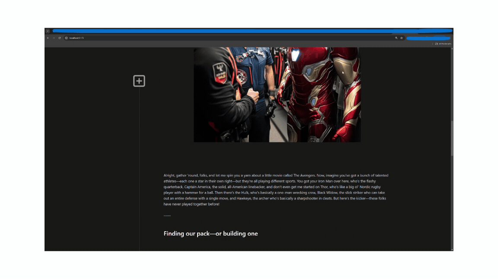

# vue3-text-collapse

A simple lightweight component to collapse long texts.

## Demo



## Setup

Business as usual by running

```sh
npm i vue3-text-collapse
```

and integrating it directly into your .vue file.

```js
<script>
import { TextCollapse } from 'vue3-text-collapse'
import 'vue3-text-collapse/dist/style.css'

// some other code
</script>
```

Remember to register it with the components.

```js
<script>
// some imports

export default {
  components: {
    TextCollapse
  },

// some other code
</script>
```

And then configure __cssTarget__, the content within the corresponding templates, and that's it.

```js
<TextCollapse cssTarget="css-target-for-collapse-to-work">
  <template #heading>This is how it goes</template>
  <template #summary>
    
    <p>
      Come to the point.
    </p>
  </template>
  <template #fullText>
    <p>
      Whatever long text you desire and in whatever format you like because the templates insert it with the HTML code.
    </p>
  </template>
</TextCollapse>
```

Fully working code example based on the vue.js generated template app included in the [repository](https://github.com/Dr4gon/vue-text-collapse).

```sh
npm i 
```

```sh
npm run dev
```

## Contributions

Any kind of requests, bugs, and so on and so forth, [write a ticket](https://github.com/Dr4gon/vue-text-collapse/issues/new).

## Status

- [x] Configure build process so dependency can be used
- [x] Write proper docu
- [ ] Clean out code
- [ ] Move cssTarget into component and auto-generate with fun names
- [ ] Replace icons with shiny new ones
- [ ] Adjust position of collapse button
- [ ] Make buttons configurable
- [x] Provide generic solution to insert the texts (~~maybe using properties~~ using vue.js templates)
- [ ] Meet Wade Wilson ake Ryan Reynolds in RL and joke around a lot
- [ ] Don't let Infinity Gauntlet lie around uselessy
- [ ] Feed Pool-Dog

### Credits

- All the images (except the icons) are created with [MidJourney](https://www.midjourney.com/) and therefore not taken from Marvel or any other source. There's absolutely no association with Marvel - also it would be very cool. They're only a humorous adaption and mix of different characters from different films or shows.
- All texts in the example App have been generated by [ChatGPT4.0](https://chatgpt.com/) using movie references from Marvels the Avengers combined Ted Lasso story telling style
- Thank you Tony for saving us all from Thanos!
- As a tribute to Thanos half the world idea, releases will be done in half version jumps ^^
- Marvel Jesus aka Deadpool aka Wade Wilson aka the Merc with the Mouth has used time traveling and the TVA to make it into this universe on Earth-1337

### License

Thank you for not reading [MIT](LICENSE)
